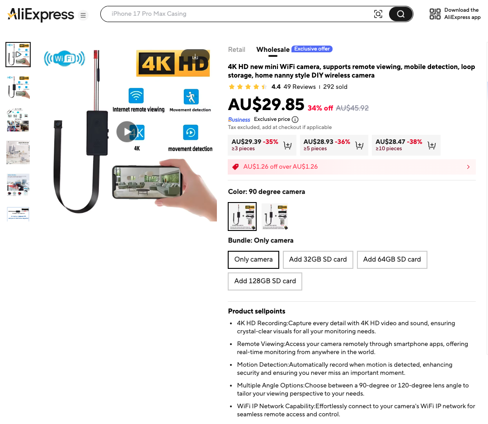

# cheap-cam-portal

> *aka **Allcam365 bypass** · **TUTK / ThroughTek Kalay bypass** · **Fullhan FH8626V100 portal** · **HYW_T729_7_A11C firmware unlock** · **yg rtsp server credentials** · sub-second live view of your AU$30 AliExpress "mini 4K WiFi cam" without the cloud.*

**Take your AU$30 AliExpress WiFi camera back from the cloud.** This is a
self-contained Mac portal that streams your cheap "mini WiFi 4K cam" live
in your browser — sub-second latency, audio, screenshots, recording, image
adjustments — **without** the proprietary app, **without** the ThroughTek
Kalay cloud relay, and **without** anyone else's servers in the middle.


```
  cam -- RTSP/H.264 + PCMU --> MediaMTX --- WebRTC ---> your browser
        (over your own LAN)    (Mac, loopback)         (sub-second, audio)
```

---

## What you get

* **Live H.264 video** at the cam's native resolution (1920×1080 on mine), 17fps,
  pulled over plain RTSP from your LAN — no cloud, no telemetry, no third party.
* **Sub-second latency** via WebRTC (we use [MediaMTX](https://github.com/bluenviron/mediamtx)
  to bridge RTSP → browser).
* **Audio playback** of the cam's mic (G.711 µ-law → Opus).
* **Screenshot** button (browser-side or original-quality server-side).
* **Record to MP4** (server-side, H.264 copy + AAC, lands in `~/Movies/cam-portal/`).
* **Browser image controls** — rotate, flip H/V, brightness, contrast, saturation,
  hue, sharpness (SVG convolve), blur, sepia, grayscale, invert, zoom, fit/fill,
  save/load preset.
* **Fullscreen + Picture-in-Picture.**
* **Live stats overlay** — resolution, kbps, fps, packet loss, jitter.
* **Auto-restart on cam power-cycle.**
* **Optional: auto-start on Mac login** via a one-shot installer.

---

## What this works on

**Tested:** a cheap "Mini WiFi 4K Cam" listed on AliExpress around AU$30 / US$20,
board marking `HYW_T729_7_A11C`, advertised as the **Allcam365** app /
**ThroughTek (TUTK Kalay)** cloud-relay device.



Internally it's:

* **SoC:** Fullhan `FH8626V100` (ARM Cortex-A7 + neural-net accel)
* **OS:** RT-Thread RTOS (not Linux — FinSH shell)
* **WiFi:** Realtek `RTL8188FTV`
* **Sensor:** SmartSens `SC1346` over MIPI
* **Flash:** GigaDevice `GD25Q32E` (4 MB SPI NOR)
* **RTSP server:** `yg rtsp server 1.0` on `:8554`
* **Default credentials:** `super` / `fullhansuper` (from Fullhan SDK)

The portal will **probably** work on any Fullhan-FH8626V100-based camera
that uses the same default credentials. Other cheap cams with a working
RTSP endpoint also work — just put your IP/credentials in `.env`.

### If you found this Googling…

…any of the following, you're in the right place:

* "Allcam365 alternative" / "Allcam365 without app" / "Allcam365 RTSP"
* "ThroughTek Kalay bypass" / "TUTK P2P alternative" / "no cloud security camera"
* "HYW_T729_7_A11C firmware" / "HYW_T729 hack" / "HYW T729 RTSP"
* "Fullhan FH8626V100 RTSP" / "FH8626 default password" / "FH8626 UART pinout"
* "yg rtsp server 1.0 credentials" / "yg rtsp server default password"
* "RT-Thread FinSH default password" / "RT-Thread cam telnet_server"
* "SmartSens SC1346 RTSP cam" / "SC1346 1080p cam"
* "Realtek RTL8188FTV cam" / "RTL8188FTV WiFi cam reverse engineering"
* "cheap AliExpress 4K mini WiFi cam hack" / "AU$30 spy cam hack"
* "self-host RTSP browser viewer Mac" / "MediaMTX WebRTC browser portal"

The defaults baked into this repo (`super` / `fullhansuper`, `:8554/stream1`)
work on the **HYW_T729_7_A11C** board listed on AliExpress under names like
*"Mini WiFi 4K Camera"*, *"Hidden HD Cam"*, *"Allcam365 Smart Camera"*, and a
dozen rebadges. They also appear on most other Fullhan-SDK-based cams.

---

## Quick start (you already know your cam's RTSP URL)

```bash
# 1. clone
git clone https://github.com/YOUR-USERNAME/cheap-cam-portal.git ~/cheap-cam-portal
cd ~/cheap-cam-portal

# 2. install + run (asks you for cam IP / user / password — press Enter to accept defaults)
./setup.sh
```

`setup.sh` will:

1. Check that Homebrew is installed (and tell you exactly what to paste if it's not).
2. `brew install` MediaMTX, ffmpeg, and python3 if missing.
3. Ask you for **cam IP** / **username** / **password** (defaults: `192.168.0.21` / `super` / `fullhansuper`).
4. Ping the cam to confirm it's reachable.
5. Generate `mediamtx.yml`.
6. Start MediaMTX + the portal Python backend.
7. Open `http://127.0.0.1:8888/` in your browser.

That's it. The portal page is at <http://127.0.0.1:8888/>.

If you close the terminal, the services keep running in the background.
Stop them with `./stop.sh`, start them again with `./start.sh`.
To make them launch automatically every time you log into your Mac,
run **`./install-autostart.sh`** (see [Auto-start](#auto-start) below).

---

## You don't know your cam's RTSP URL — the hardware-hack story

This is what I had to do to extract the RTSP credentials from a sealed cam
that only spoke to a proprietary cloud app. **You only need to do this
once**, and you do NOT need a serial cable to *use* the portal — only to
*discover the credentials* if they aren't `super` / `fullhansuper`.

> If `./setup.sh` works with the defaults and you see live video in your
> browser, **skip this whole section** and have fun. Come back if your
> cam isn't a Fullhan board.

### What's in the box


The cam I bought ships with a tiny USB-C breakout and… that's it. No
manual, no firmware, no documentation. The only way to use it as
advertised is to install **Allcam365** on a phone and hand your WiFi
credentials to a Chinese cloud relay run by [ThroughTek](https://www.throughtek.com/).
Hard pass.

### Step 1 — open the case

Two small Phillips screws on the bottom, the case pops open by hand.
Inside is a single small PCB.


The visible chips are:

* Fullhan **FH8626V100** SoC (the big square one)
* Realtek **RTL8188FTV** WiFi module (the little daughter-board with the
  RF can)
* SmartSens **SC1346** image sensor (under the lens)
* GigaDevice **GD25Q32E** 4 MB SPI NOR flash

### Step 2 — find the UART pads

Three pads I tagged in the photo below are the FinSH (RT-Thread serial
shell) UART:


* **TX**  → cam talks
* **RX**  → cam listens
* **GND** → ground

Voltage is **3.3 V** (the SoC is a 3.3 V part). **Do not connect a 5 V
serial line.** An FT232RL set to 3.3 V is perfect. So is any USB-TTL
adapter with a 3.3 V switch.

### Step 3 — wire up an FT232RL (or equivalent)

The FT232RL pinout:


Cross-wire so the cam's TX goes to the adapter's RX and vice versa:

| FT232RL pin | Cam pad |
|------------|---------|
| `RXD`      | cam **TX** |
| `TXD`      | cam **RX** |
| `GND`      | cam **GND** |

**Do not connect the FT232RL's 5V or 3V3 pins** — power the cam from its
normal USB-C connector. Connecting both can fight or fry things.


Plug the FT232RL into your Mac. It should show up as
`/dev/cu.usbserial-XXXXXXXX` (run `ls /dev/cu.*` to find the exact
name).

### Step 4 — open a serial terminal

Any 115200-baud terminal works. I used:

```bash
# Easiest: macOS's built-in 'screen' command
screen /dev/cu.usbserial-XXXXXXXX 115200
# (to exit screen: Ctrl-A, then K, then Y)
```

Now power on the cam (USB-C). You'll see a flood of boot messages and
eventually:


```
Password for login: 
```

Type **`123456`** and hit Enter. You'll get a `finsh />` prompt.

### Step 5 — pull the RTSP credentials out of memory

Inside FinSH:

```text
finsh /> db_list()
```

This dumps the cam's runtime config database. Look for these keys:

```
user_name[0]      = super
user_password[0]  = fullhansuper
```

That's it. Those are your RTSP credentials. The defaults match what
ships from Fullhan's reference SDK, which is what nearly every cheap
4K cam built around `FH8626V100` uses.

While you're in there, useful one-shots:

```text
finsh /> ifconfig         # shows the cam's current IP
finsh /> list_thread      # all the running threads
finsh /> save_snapshot()  # captures a JPEG into the buffer at 0xa3894000
finsh /> dump_mem(0xa3894000, 0x4000)   # dumps memory as hex (slow over UART)
```

### Step 6 — provision WiFi (one-time)

Out of the box, the cam comes up in **AP mode** broadcasting its own
SSID. Connecting it to your home WiFi happens via the Allcam365 app the
*one time*, then it remembers and reconnects on every boot:

* Install Allcam365 on a phone (Android Emulator works too — I used
  Android Studio's AVD with a `Pixel 6 / android-33 / google_apis_playstore`).
* Add a device, give it your SSID + password.
* Once paired, the cam connects to your WiFi, gets a DHCP lease (mine:
  `192.168.0.21`), and the AP disappears.

After that, **delete the app if you want** — the cam autonomously
reconnects on every power-cycle without needing it.

### Step 7 — verify with ffplay (no portal yet)

```bash
ffplay -rtsp_transport tcp -fflags nobuffer -flags low_delay -framedrop \
  "rtsp://super:fullhansuper@<YOUR_CAM_IP>:8554/stream1"
```

You should see a native window with the cam feed at full 1080p, well
under 1 second of latency. **At this point you can unplug the FT232RL
forever.** Everything from here on is over WiFi.

### Step 8 — run the portal

Back to the [Quick start](#quick-start-you-already-know-your-cams-rtsp-url) at the top.

---

## Using the portal

Open <http://127.0.0.1:8888/> in your browser.


### Streaming panel

| Button | What it does |
|--------|--------------|
| **Reconnect** | Tears down and re-creates the WebRTC peer — fixes the rare case where ICE gets wedged. |
| **🔇 Muted / 🔊 Audio** | Browser autoplay rules force the page to start muted. Click once to enable audio. |
| **Volume slider** | Standard volume. Setting > 0 also auto-unmutes. |
| **⛶ Fullscreen** | Standard browser fullscreen. |
| **⧉ PiP** | Picture-in-Picture (floats the video over other windows). |

### Capture panel

| Button | What it does |
|--------|--------------|
| **📸 Screenshot (local)** | Renders the *current displayed frame including filters* to a PNG and pops a save dialog. |
| **📸 Screenshot (server, full quality)** | Asks the backend to grab one fresh frame from the cam via ffmpeg; saves to `~/Pictures/cam-portal/` and shows you a preview. Bypasses CSS filters. |
| **⏺ Record (browser)** | Uses the browser's `MediaRecorder` on a canvas that mirrors what you see (filters baked in). Output is a `.webm` (or `.mp4` if your browser supports it) downloaded when you press Stop. |
| **⏺ Record (server MP4)** | Spawns ffmpeg on the Mac to pull the source RTSP and write an MP4 to `~/Movies/cam-portal/`. Original quality, audio included, immune to tab close. **Recommended.** |

Recent recordings + screenshots show up in the small list beneath the
buttons.

### Image controls panel

| Control | Range | Implementation |
|---------|-------|----------------|
| **Rotation** | 0 / 90 / 180 / 270° | CSS `transform: rotate(…)` |
| **Flip H / V** | toggle | CSS `transform: scale(±1, ±1)` |
| **Brightness** | 0 – 300 % | CSS `filter: brightness(…)` |
| **Contrast** | 0 – 300 % | CSS `filter: contrast(…)` |
| **Saturation** | 0 – 300 % | CSS `filter: saturate(…)` |
| **Hue rotate** | -180 – 180° | CSS `filter: hue-rotate(…)` |
| **Sharpness** | 0 – 200 % | SVG `<feConvolveMatrix>` |
| **Blur** | 0 – 20 px | CSS `filter: blur(…)` |
| **Sepia / Grayscale / Invert** | 0 – 100 % | CSS filters |
| **Zoom** | 100 – 400 % | CSS `transform: scale(…)` |
| **Fit / Fill** | toggle | CSS `object-fit` |
| **Reset all** | one click | restores defaults |
| **Save / Load preset** | one click each | stores in `localStorage` |

All adjustments are **browser-side**. They affect what you see, what
screenshots you take, and what `Record (browser)` captures.

They **do not** change what the cam encodes, so `Record (server MP4)`
always saves the raw cam stream regardless of which filters are on.
(That's usually what you want — you can always re-filter a recording
later, but you can't recover information the cam threw away.)

### Stats panel

Live `getStats()` from the WebRTC peer:

```text
state:        connected / connected
video:        1920x1080 @ 17.0 fps
video kbps:   520
frames recv:  4231
frames drop:  0
packetsLost:  0
jitter:       0.001
audio kbps:   ~ 12
```

Watch `frames drop` and `packetsLost` — they're your early-warning for
flaky WiFi.

---

## Auto-start

So you never have to think about this again:

```bash
./install-autostart.sh
```

This writes two launchd agents into `~/Library/LaunchAgents/`:

* `com.cheapcamportal.mediamtx.plist` — keeps MediaMTX alive
* `com.cheapcamportal.portal.plist` — keeps the Python backend alive

Both have `RunAtLoad = true` and `KeepAlive = true`, so they:

* Start automatically when you log into your Mac,
* Restart automatically if they crash,
* Stop when you log out / shut down.

Reverse it with:

```bash
./uninstall-autostart.sh
```

After install, the portal is just always at <http://127.0.0.1:8888/>.
You can pin that tab in your browser.

---

## What survives a power-cycle?

| Thing | Survives cam reboot? | Survives Mac reboot? |
|------|----------------------|----------------------|
| Cam streams over WiFi on `:8554/stream1` | ✅ yes, RTSP auto-starts | n/a |
| Cam stays connected to your WiFi | ✅ yes, credentials are flashed | n/a |
| MediaMTX retries the cam source | ✅ yes (`sourceOnDemand: no`) | ✅ if you ran `./install-autostart.sh` |
| Portal backend (`portal.py`) | n/a | ✅ if you ran `./install-autostart.sh` |
| `./start.sh`-launched processes | n/a | ❌ they die with the shell session |

Translation: once `./install-autostart.sh` is run, you can pull the
serial cable, power-cycle the cam, reboot the Mac, and the URL still
works without you doing anything.

---

## Troubleshooting

### Browser shows "connecting WHEP…" forever

* Check MediaMTX log: `tail -50 logs/mediamtx.log`
* If you see `stream is not available`, the cam is unreachable. Check:
    * Cam IP in `.env` matches your router's DHCP table.
    * Mac is on the same WiFi network as the cam.
    * `ping <CAM_IP>` succeeds.

### MediaMTX log says `404 Not Found` for `/stream1`

* Try `CAM_PATH=stream0` in `.env`, re-run `./regen-config.sh`, then
  `./start.sh`.
* If neither works, your cam's vendor uses a different path. Use VLC or
  ffmpeg to probe — most cams advertise their paths via RTSP DESCRIBE.

### MediaMTX log says `401 Unauthorized`

* Wrong RTSP credentials. Either:
    * Try `admin` / `<blank password>` (common second default).
    * UART in and use `db_list()` (see [hardware-hack](#step-5--pull-the-rtsp-credentials-out-of-memory)).

### Video looks fine but no audio

* Click the **🔇 Muted** button or move the volume slider above zero.
  Browsers refuse to autoplay sound until the user interacts.

### Recording produces a 0-byte file

* You stopped recording before ffmpeg saw a keyframe (cam GOP is ~5s).
  Wait at least 6 seconds before stopping.

### Port 8888 or 8889 already in use

* Edit `.env` to set `HTTP_PORT=` and `WEBRTC_PORT=` to free ports.
* Re-run `./regen-config.sh && ./start.sh`.

### Mac's serial port is shared by `qemu` (Android emulator)

* If you're running an Android emulator, it may grab `:8554` on
  localhost. We disabled MediaMTX's RTSP server by default
  (`rtsp: no` in `mediamtx.template.yml`) so this isn't an issue.

### Re-run setup from scratch

```bash
./stop.sh
./uninstall-autostart.sh 2>/dev/null || true
rm -f .env mediamtx.yml
./setup.sh
```

---

## Architecture

```
┌─────────────────────────┐
│  HYW_T729 camera        │
│  Fullhan FH8626V100     │
│  yg rtsp server 1.0     │
│  H.264 + PCMU on :8554  │
└──────────┬──────────────┘
           │ RTSP over TCP (your LAN, WiFi)
           ▼
┌─────────────────────────┐
│  MediaMTX (your Mac)    │
│  rtsp client (source)   │
│  webrtc server (loopback)│
│  127.0.0.1:8889 (WHEP)   │
└──────────┬──────────────┘
           │ WebRTC (Opus audio + H.264 video, sub-second)
           ▼
┌─────────────────────────────────┐
│  Browser (any modern: Safari,   │
│  Chrome, Firefox)               │
│  - WebRTC <video> element       │
│  - CSS filter pipeline          │
│  - MediaRecorder for local rec  │
└──────────┬──────────────────────┘
           │ fetch / XHR
           ▼
┌─────────────────────────────────┐
│  Python portal backend          │
│  127.0.0.1:8888                 │
│  serves HTML/CSS/JS             │
│  /screenshot   -> ffmpeg jpeg   │
│  /record/start -> ffmpeg mp4    │
│  /record/stop                   │
│  /status, /recordings           │
└─────────────────────────────────┘
```

* The browser pulls **media** directly from MediaMTX (port 8889) over
  WebRTC, so the Python backend never proxies video bytes.
* The Python backend is purely a static-file server + recording/screenshot
  controller; it spawns ffmpeg processes against the *original* RTSP URL
  for server-side capture (full quality, original codec).

---

## File layout

```
cheap-cam-portal/
├── README.md                    # this file
├── LICENSE                       # MIT
├── .env.example                  # copy → .env (or let setup.sh do it)
├── .gitignore
├── mediamtx.template.yml         # rendered → mediamtx.yml by setup.sh
├── setup.sh                      # one-time install + start
├── start.sh                      # launch services (idempotent)
├── stop.sh                       # kill services
├── regen-config.sh               # regenerate mediamtx.yml from .env
├── install-autostart.sh          # opt-in launchd agents
├── uninstall-autostart.sh
├── portal/
│   ├── portal.py                 # Python backend
│   ├── index.html
│   ├── portal.css
│   └── portal.js
├── photos/                       # README image assets — drop yours here
│   └── README.md                 # what each filename should be
├── launchd/
│   ├── com.cheapcamportal.mediamtx.plist.template
│   └── com.cheapcamportal.portal.plist.template
└── logs/                         # mediamtx + portal stdout/stderr
```

---

## Credits & Acknowledgements

* **[MediaMTX](https://github.com/bluenviron/mediamtx)** — the heroic bit
  of Go that does the RTSP → WebRTC bridge in 30 MB and ~10 lines of
  YAML.
* **[FFmpeg](https://ffmpeg.org/)** — for the server-side capture path.
* **[Fullhan](https://www.fullhan.com/)** — for shipping an SDK that
  leaves `super`/`fullhansuper` enabled by default. Thanks I guess.
* **[RT-Thread](https://www.rt-thread.org/)** — for FinSH, which made
  the reverse-engineering pleasant.
* **Anyone reading this** — if you find another camera model that works,
  please open an issue or PR listing the board marking, SoC, default
  RTSP path, and credentials. The goal is a community list of "cheap
  cams you can liberate."

---

## License

MIT. See `LICENSE`. You owe me nothing. If you want, you can owe me a
star on the repo.
